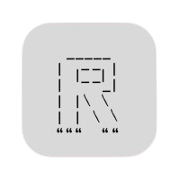
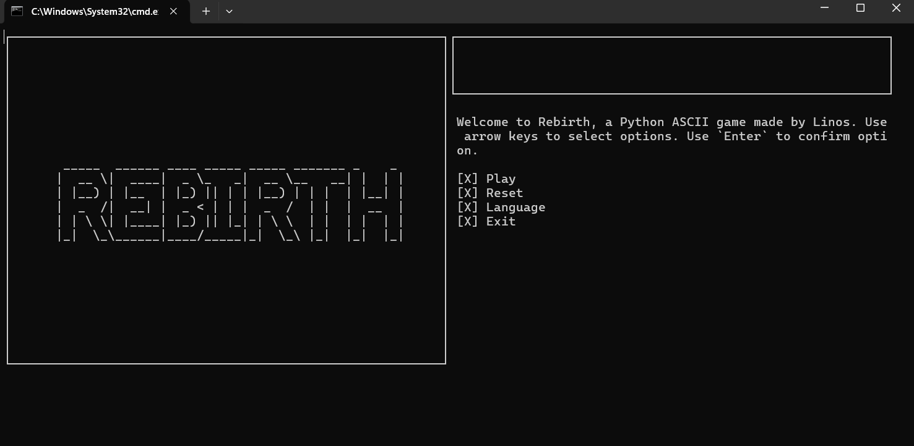
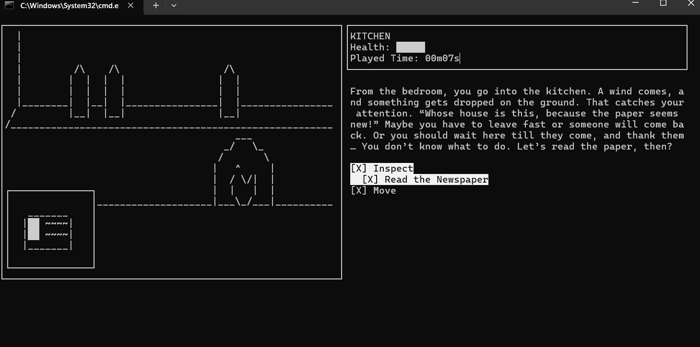
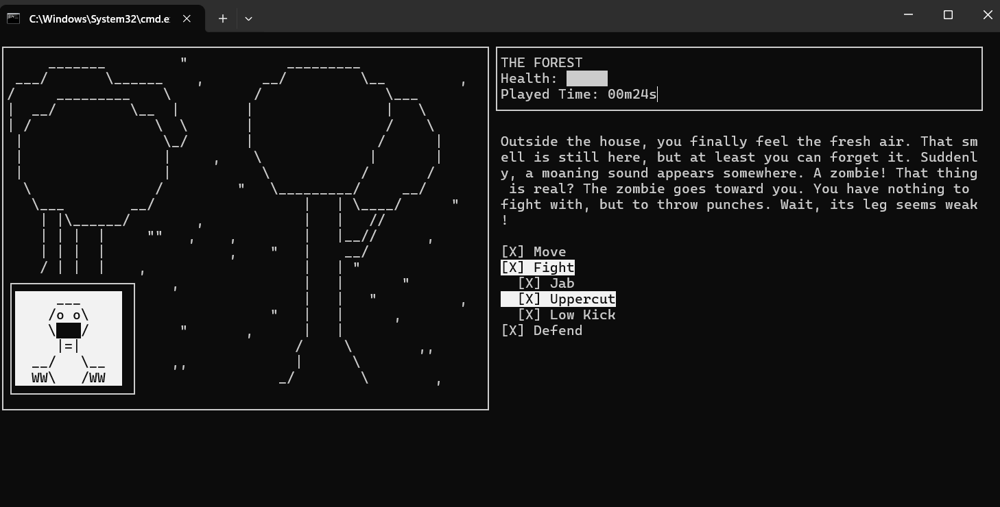
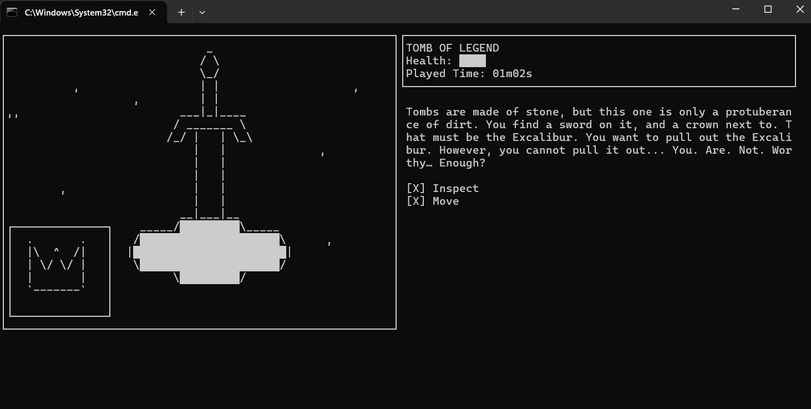

# REBIRTH

**PYTHON ASCII GAME**

 

## Introduction:

I made this game initially for my school project. And I think everyone should try it!

There are total 5 endings (2 are hidden).

 

## Ingame Screenshot

 

## Requirements:
- Be a Window user.
- Terminal size minimum is 80x24.
- Have fun.

 

## Controlling:

Use arrow keys to choose options. Then press `Enter` to confirm.
- `Up` & `Down` to move up and down
- `Left` & `Right` to to show and unshow child options.

**Notice:** If you cannot choose, that means it is not suppose to be chosen. Try `Right` or select another one.

In combat, choose either `Fight` or `Defend` or `Move` (escaping).
- `Fight`: If you choose the right style, you can one hit your enemy.
- `Defend`: There are two options `Block` and `Dodge`. `Block` has 50% success. `Dodge` has 75% success, but when failed, has 10% lose 2hp.

 

## Contributing:

- Refining English [`i18n`](rebirth/assets/i18n/text.en.yml) text is always welcomed.
- If you want to add translations, feel free to add your language in [`rebirth/assets/i18n`](rebirth/assets/i18n) as a pull request. Rename as f"text.{your_lang}.yml".
- If you want to redraw scenes(57x22)/events(13x6) or add new features, make sure to list them clearly in your pull request.
